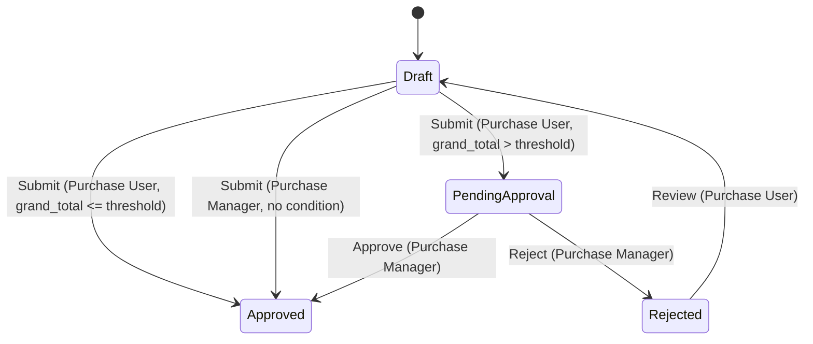
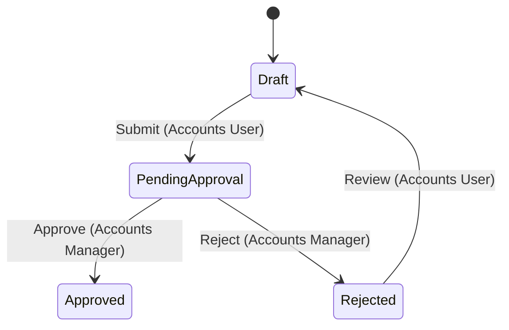
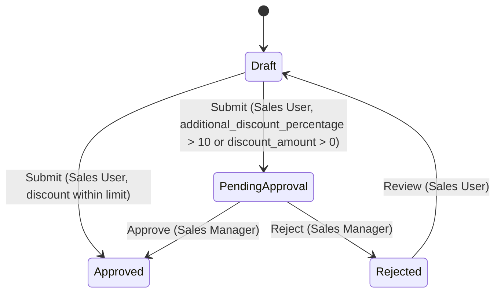
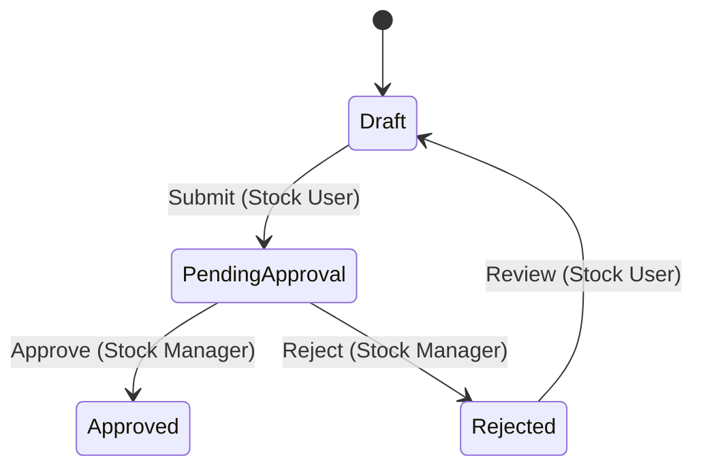

# Default Approval Workflows

ERPNext ships zero standard `Workflow` records out of the box — every site has
to hand-configure Frappe's workflow engine. This content pack closes that gap:
it ships four ready-made approval workflows as plain-python record definitions
(`definitions.py`) plus an idempotent installer (`installer.py`). Nothing here
adds a doctype; only **records** of the framework doctypes `Workflow`,
`Workflow State` and `Workflow Action Master` are created on the site.

## What ships

| Slug | Document Type | Approval rule |
|---|---|---|
| `purchase-order-approval` | Purchase Order | PO above the threshold needs Purchase Manager approval |
| `journal-entry-approval` | Journal Entry | Every JE needs Accounts Manager approval (four-eyes) |
| `sales-invoice-discount-approval` | Sales Invoice | Discount > 10% (or any flat discount amount) needs Sales Manager approval |
| `material-request-approval` | Material Request | Every MR needs Stock Manager approval |

All workflows use `workflow_state_field = "workflow_state"`, the shared states
**Draft** (docstatus 0), **Pending Approval** (docstatus 0, edit locked to the
approving role), **Approved** (docstatus 1) and **Rejected** (docstatus 0),
and the actions **Submit**, **Approve**, **Reject**, **Review**. On the
`Approve`/`Reject` transitions `allow_self_approval` is 0, so the document's
author cannot approve their own document.

### Purchase Order Approval



### Journal Entry Approval



### Sales Invoice Discount Approval



### Material Request Approval



## How thresholds work

Condition strings in `definitions.py` may carry the literal placeholder
`{approval_threshold}` (only the Purchase Order workflow uses it today). At
install time the installer replaces the placeholder with a number — the
module-level `DEFAULT_APPROVAL_THRESHOLD` (10,000 in company currency) or the
`approval_threshold` argument you pass — producing a plain
`frappe.safe_eval`-able condition such as `doc.grand_total > 50000.0`.

The threshold is baked into the created Workflow record; to change it later,
edit the transition conditions on the Workflow document, or deactivate and
reinstall under a new name.

## Install API

All installer entry points are whitelisted and require the **System Manager**
role.

```bash
# install everything with defaults (active immediately)
bench --site <site> execute erpnext.setup.default_workflows.installer.install_all

# install everything with a custom PO threshold, staged (inactive)
bench --site <site> execute erpnext.setup.default_workflows.installer.install_all \
    --kwargs '{"approval_threshold": 50000, "activate": false}'

# install a single workflow
bench --site <site> execute erpnext.setup.default_workflows.installer.install_workflow \
    --kwargs '{"slug": "purchase-order-approval", "approval_threshold": 25000}'

# list slugs + install status
bench --site <site> execute erpnext.setup.default_workflows.installer.get_available_workflows

# deactivate (records are kept — documents may reference the states)
bench --site <site> execute erpnext.setup.default_workflows.installer.uninstall_workflow \
    --kwargs '{"slug": "journal-entry-approval"}'
```

Behavior notes:

- **Idempotent** — a Workflow whose `workflow_name` already exists is skipped
  (returned with `status: "skipped"`), so `install_all` is safe to re-run.
- Missing `Workflow State` / `Workflow Action Master` masters are created
  first, each guarded by `frappe.db.exists`.
- `activate=False` installs with `is_active = 0` so admins can review and
  stage before switching a workflow on from the Workflow form.
- `uninstall_workflow` only sets `is_active = 0`; it never deletes, because
  existing documents may already carry the workflow's states in their
  `workflow_state` field.

## Tests

`test_default_workflows.py` validates the definitions as pure data (every
transition references a defined state, doc_status values are the strings
`"0"/"1"/"2"`, roles are shipped ERPNext roles, condition strings compile as
python expressions). It needs no site:

```bash
python -m unittest erpnext.setup.default_workflows.test_default_workflows
```
